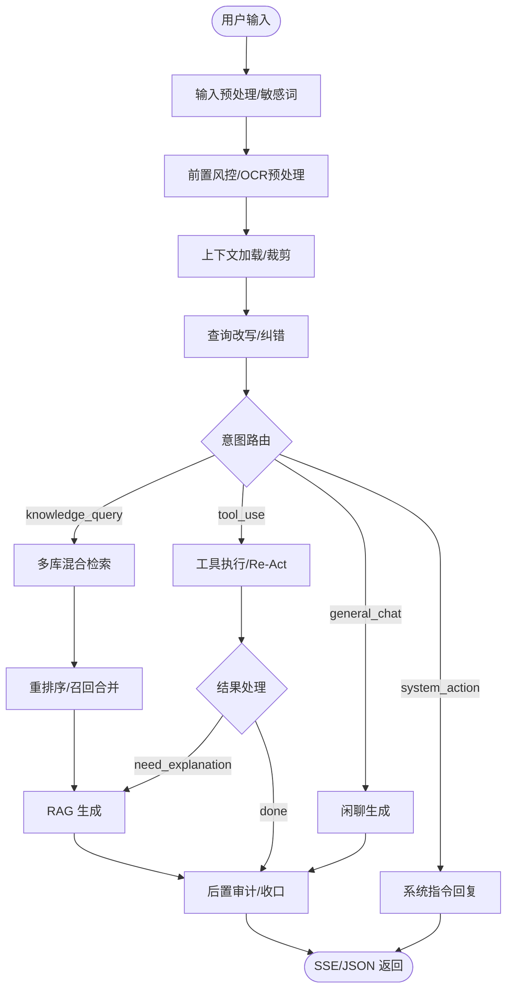

# ReviewPulse Agent

ReviewPulse Agent 是一个面向电商/服务行业的增强型 **RAG (Retrieval-Augmented Generation)** 后端服务。它不仅提供了基础的知识库管理与问答能力，还集成了 **LangGraph 智能体编排**、**自然语言数据分析 (Pandas Executor)**、**多模态 OCR** 以及 **高级 ETL 数据流水线**，旨在构建一个闭环的智能助手后端。

---

## 核心功能

### 1. 核心 RAG 能力
- **语义搜索**：基于本地 BGE Embedding 和 Chroma 向量数据库，支持高精度的混合检索。
- **查询改写与纠错**：支持多轮对话上下文改写及自动错别字纠正（如“葡淘” -> “葡萄”），提升召回率。
- **检索缓存**：内置向量检索与会话上下文双重缓存机制（Redis/内存），显著降低生成延迟。

### 2. 智能体 (Agent) 架构
- **动态编排**：基于 **LangGraph** 实现的灵活对话引擎，支持意图路由、工具调用、RAG 问答与闲聊的自动切换。
- **Re-Act 迭代**：支持多步骤迭代推理与执行，确保复杂任务的准确闭环。

### 3. 多样化服务支撑
- **Pandas 智能数据分析**：支持通过自然语言直接进行数据统计与图表生成，代码在 E2B 安全沙箱中执行。
- **多模态 OCR**：集成 PaddleOCR，支持从图片中自动提取文本并融入对话上下文。
- **高级 ETL 流水线**：独立的数据处理引擎（`data_pipeline`），支持丰富的清洗器、抽取器及动态模板配置，轻松处理海量非结构化数据。

### 4. 完备的管理后台
- **知识库工作台**：支持文档上传、下载、编辑、切片预览及向量化审核。
- **会话与日志**：详尽的会话链路日志（JSONL 格式），支持回滚、重命名、导出与审计。
- **系统在线配置**：支持对检索参数、Embedding 模型等进行热更新。

---

## 技术栈

- **后端框架**: [FastAPI](https://fastapi.tiangolo.com/) (异步高性能)
- **智能体编排**: [LangGraph](https://python.langchain.com/docs/langgraph/)
- **向量数据库**: [Chroma](https://www.trychroma.com/)
- **嵌入模型**: BAAI/BGE (本地运行)
- **大语言模型**: 兼容 OpenAI 协议的各类模型（如 Qwen 系列）
- **数据处理**: Pandas, PaddleOCR
- **数据库**: MySQL (持久化), Redis (缓存)
- **执行沙箱**: [E2B](https://e2b.dev/) (用于安全代码执行)

---

## 架构概览 (LangGraph 对话链路)



---

## 快速开始

### 环境依赖
- Python 3.11+
- MySQL 8.0+
- Redis 7.0+
- CUDA (推荐，用于加速 Embedding)

### 1. 安装
```powershell
git clone <repository-url>
cd "ReviewPulse Agent"
python -m venv .venv
.\.venv\Scripts\Activate.ps1
pip install -r requirements.txt
```

### 2. 配置
拷贝环境模板并修改：
```powershell
cp .env.example .env
```
**关键变量说明：**
- `DATABASE_URL`: MySQL 连接串（需支持异步 `asyncmy`）。
- `REDIS_URL`: Redis 服务地址。
- `API_KEY`: 大模型 API Key。
- `BGE_MODEL_PATH`: 本地 Embedding 模型存放目录。
- `E2B_API_KEY`: (可选) 用于 Pandas 分析的高级沙箱。

### 3. 运行
```powershell
# 启动 API 服务
python main.py
```
- **交互式文档**: `http://127.0.0.1:8001/docs`
- **运行健康检查**: `http://127.0.0.1:8001/`

---

## 开发与测试

### 运行测试
项目采用 `pytest` 进行全链路覆盖：
- 运行全部测试：`python -m pytest`
- 运行新增接口测试：`python -m pytest tests/api/ -q`
- 运行 LangGraph 架构测试：`python -m pytest tests/test_chat_langgraph_architecture.py`

### 脚本工具
- `scripts/verify_rag_runtime.py`: 快速验证 RAG 运行环境。
- `scripts/fine_tune_bge.py`: BGE 模型微调工具。

---

## 目录结构

详细的目录与文件职责说明请参考：[项目结构.txt]
