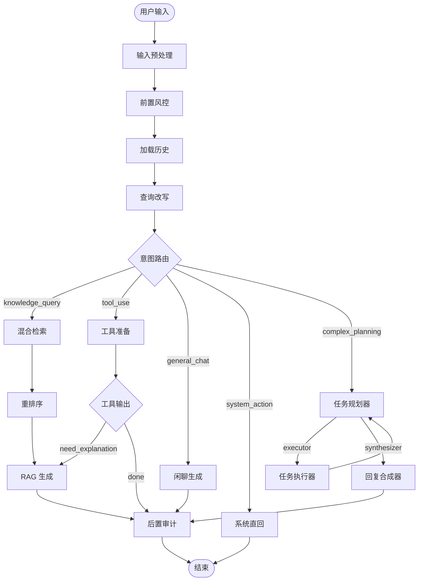

# Chat LangGraph 智能体架构

本目录实现了 ReviewPulse Agent 的核心对话编排逻辑。通过使用 **LangGraph**，我们将复杂的对话流程拆解为多个独立的节点（Node），并通过条件边（Conditional Edges）实现灵活的路径跳转。

---

## 1. 流程概览

智能体拓扑结构包含了两大核心路径：**标准 RAG 路径**与**动态多智能体规划路径**。

---

## 2. 核心组件说明

### 2.1 状态管理 (`state.py`)
所有的节点共用一个状态对象 `ChatGraphState`。它不仅包含了基础的输入输出，还承载了中间过程的上下文：
- `rewritten_query`: 经过 LLM 改写后的标准查询。
- `sources`: 检索到的原始文档片段。
- `past_steps`: (多智能体) 记录之前每一轮规划执行的任务与结果摘要。
- `is_complex_task`: 布尔标志，决定是否进入动态规划循环。

### 2.2 图定义 (`graph.py`)
`graph.py` 负责定义图的拓扑结构。它通过 `ChatGraphCallbacks` 接收具体的业务逻辑注入，解耦了“流程编排”与“具体实现”。关键路由函数包括：
- `_route_dispatcher`: 根据 `is_complex_task` 决定跳转方向。
- `_route_planner`: 根据 Planner 的输出判断是继续执行 (`executor`) 还是进行总结 (`synthesizer`)。

---

## 3. 智能体运作机制 (结合代码)

智能体在 `app/api/v1/chat.py` 中被实例化并运行。

### 3.1 预处理与改写
1. **`input_process`**: 标准化用户输入，整合 OCR 文本（如有）。
2. **`rewrite`**: 调用 `rewrite_question`。即使是单轮对话，也会进行“错别字纠正”等预处理。

### 3.2 智能路由重定向
在 `router` 节点中，系统通过 `master_router` 判断意图。
- **触发条件**：如果用户上传了数据文件（`file_ids` 不为空）或 LLM 识别出复杂复合需求，`is_complex_task` 将被设为 `True`。
- **重定向**：流程将进入 `planner` 节点，而非简单的检索或生成。

### 3.3 多智能体动态规划循环 (Dynamic Re-Act Loop)
这是本项目的进阶能力，用于处理无法通过单轮检索解决的问题（例如：既要查规章，又要分析数据，还要查评论）：

1. **Planner (规划器)**：
   - 模型：`kimi-k2.5`。
   - 职责：查看 `rewritten_query` 和 `past_steps`，分析还有哪些事没做。
   - 输出：`[数据分析]`、`[知识检索]` 或 `[工具调用]` 指令。
2. **Executor (执行器)**：
   - 职责：根据指令调用对应的底层服务（如 `PandasAnalyzer`、`search_across_knowledge_bases` 或业务工具）。
   - 结果：将执行结果存入 `past_steps` 并返回 `planner`。
3. **Synthesizer (合成器)**：
   - 职责：当任务完成时，汇总所有中间步骤的执行报告，起草一份专业的最终回答。

### 3.4 流式输出策略
为了保证前端响应速度，图在流式模式（`stream=True`）下遵循以下逻辑：
- **图内预演**：图先运行以确定路由路径、完成检索动作或准备好工具参数。
- **异步生成**：图运行结束后，在 API 层通过 `FastAPI.StreamingResponse` 调用对应的流式生成器（如 `answer_with_context_stream`）。

---

## 4. 关键目录文件

- `state.py`: 维护 `TypedDict` 形式的全局状态字段。
- `graph.py`: 负责 `StateGraph` 的构建、节点添加及 `Conditional Edges` 逻辑。
- `orchestrator.py`: 提供 `run()` 方法简化图的调用，并支持将图导出为 Mermaid 文件（存放于 `data/logs/chat_graph.mmd`）。
